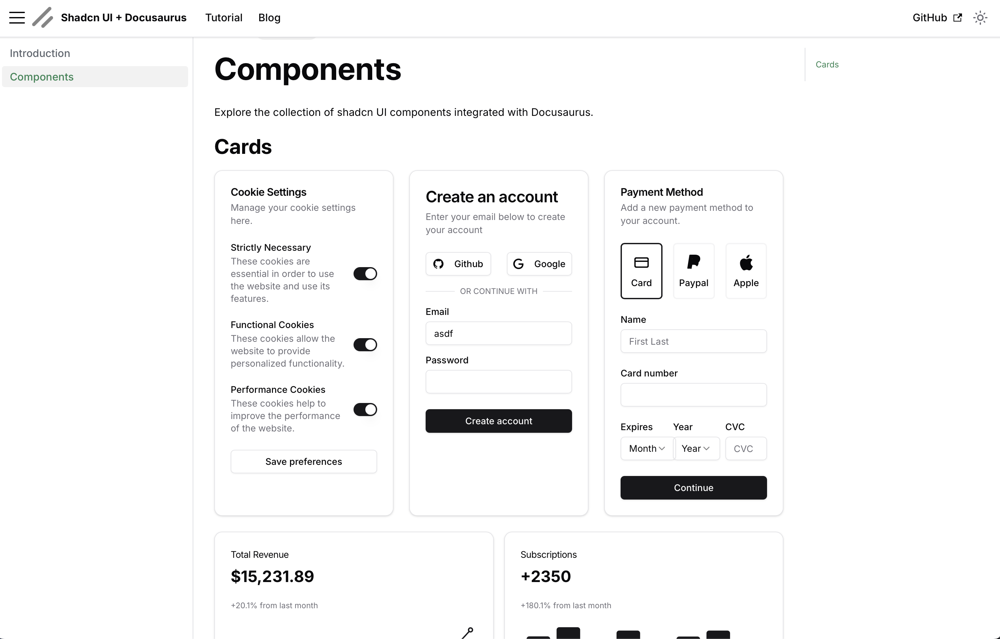

# Docusaurus + Shadcn UI Starter

This repo is designed to demonstrate how you can integragte [Shadcn UI](https://ui.shadcn.com/) components within a [Docusaurus](https://docusaurus.io/) documentation site.

The goals of this starter were to allow users to:

1. Get started quickly
2. Use Docusaurus and Shadcn UI styles together
3. Install new Shadcn UI components with `npx shadcn@latest add <component>` like any other project.



## Features

- 🎨 Fully styled shadcn-ui components
- 📚 Docusaurus documentation setup
- 🎯 Interactive component examples
- 🌙 Dark mode support
- 📱 Responsive design example

## Prerequisites

- Node.js 19 or above
- npm

## Getting Started

1. Clone the repository:
   ```bash
   git clone (https://github.com/onwardplatforms/shadcn-docusuarus-starter.git)
   cd app
   ```

2. Install dependencies:
   ```bash
   npm install
   ```

3. Start the development server:
   ```bash
   npm run start
   ```

The site will be available at `http://localhost:3000`

## Project Structure

- `/src/pages` - Main pages including the homepage with a custom hero section
- `/docs` - Documentation content written in MDX, including interactive component examples
- `/components` - shadcn-ui components and custom components

## Documentation

The documentation includes interactive examples of shadcn-ui components. Visit the `/docs/intro` page to see examples like:
- Button components
- Card layouts
- Form elements
- And more!

## Contributing

Contributions are welcome! Please feel free to submit a Pull Request.

## License

MIT
